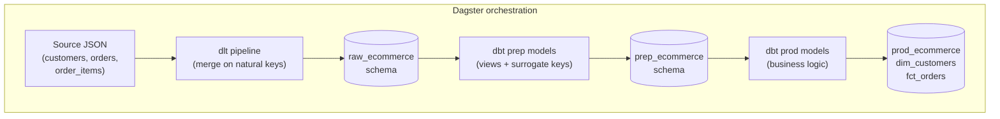
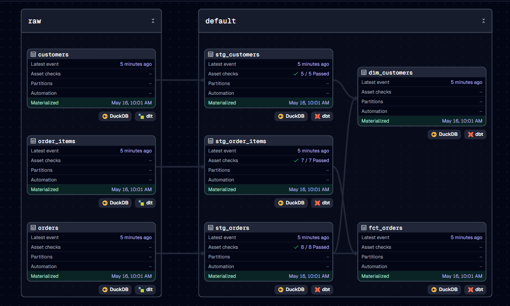

# mini-voyager

A local 3-layer data platform — **dlt → dbt → Dagster on DuckDB** — that mirrors a production stack (Databricks + dbt Cloud + Dagster Cloud) using only free, locally-runnable equivalents.

## Why this exists

A learning project and portfolio piece for end-to-end data engineering. It demonstrates:

- A clean **medallion architecture** (raw → prep → prod) inside a single DuckDB file.
- **Orchestrated ELT** where one click in Dagster rebuilds the entire DAG.
- **Tested transformations** — uniqueness, not-null, foreign-key, and accepted-values tests across the staging layer (20 total).
- **Row-level lineage** — every row in the prod marts traces back to a specific dlt load.

## Architecture



### Live in Dagster

<!-- TODO: capture this screenshot from `dagster dev` after a successful "Materialize all" run, then drop the PNG at docs/dagster-graph.png -->



*Asset graph after a successful end-to-end materialization.*

## Stack — local vs production equivalents

| What's used here          | Production equivalent              | Role                          |
| ------------------------- | ---------------------------------- | ----------------------------- |
| **DuckDB** (single file)  | Snowflake / BigQuery / Databricks  | Warehouse                     |
| **dbt-core** (CLI)        | dbt Cloud                          | Transformations + tests       |
| **dlt** (OSS)             | Fivetran / Airbyte                 | Ingestion / EL                |
| **Dagster** (OSS)         | Dagster Cloud / Airflow / Prefect  | Orchestration + lineage UI    |
| Local JSON files          | S3 / GCS / Kafka                   | Source system                 |

## Project structure

```
mini-voyager/
├── ingestion/
│   ├── seeds/generate_source_data.py     # Faker-based seed data generator
│   └── pipelines/ecommerce_pipeline.py   # dlt pipeline -> raw_ecommerce
├── transformations/mini_voyager/         # dbt project
│   ├── models/prep/                      # 3 staging views + tests
│   ├── models/prod/                      # dim_customers, fct_orders
│   ├── macros/get_custom_schema.sql      # custom schema name resolution
│   └── packages.yml                      # dbt-utils 1.3.0
├── orchestration/                        # Dagster project
│   └── mini_voyager_orchestration/
│       ├── definitions.py                # asset + resource registration
│       ├── resources.py                  # DbtProject + paths
│       └── assets/
│           ├── dbt_assets.py             # `dbt build` as Dagster asset
│           └── dlt_assets.py             # dlt resources as Dagster assets
├── warehouse/mini_voyager.duckdb         # the warehouse (gitignored)
└── requirements.txt
```

## Setup

**1. Clone and create a virtualenv**

```bash
git clone https://github.com/Swaraj1703/mini-voyager.git
cd mini-voyager
python -m venv .venv
source .venv/bin/activate
```

**2. Install dependencies**

```bash
pip install -r requirements.txt
```

**3. Create your dbt profile** at `~/.dbt/profiles.yml` (this file lives outside the repo by dbt convention and is intentionally not committed):

```yaml
mini_voyager:
  target: dev
  outputs:
    dev:
      type: duckdb
      path: /absolute/path/to/mini-voyager/warehouse/mini_voyager.duckdb
      schema: main
      threads: 4
```

The dbt-managed schemas (`prep_ecommerce` and `prod_ecommerce`) are pinned in `dbt_project.yml` via `+schema:` overrides and resolved by the custom `generate_schema_name` macro; `raw_ecommerce` is owned by dlt and set via the pipeline's `dataset_name`. The profile's `schema:` only needs to be a valid placeholder.

**4. Generate seed source data**

```bash
python ingestion/seeds/generate_source_data.py
```

Produces 50 customers, 200 orders, and ~500 line items as JSON under `ingestion/source_data/` (gitignored).

## Run the platform

### One-click (Dagster UI)

```bash
cd orchestration
dagster dev
```

Open <http://localhost:3000>, click **Materialize all**. Dagster runs the dlt pipeline (raw layer), then `dbt build` (prep + prod + 20 tests) in dependency order.

### Component-by-component (CLI)

For debugging a single layer in isolation:

```bash
# Raw layer (dlt ingest)
python ingestion/pipelines/ecommerce_pipeline.py

# Prep + prod layer (dbt build runs models AND tests)
cd transformations/mini_voyager
dbt deps
dbt build
```

## Data model

Three schemas, one DuckDB file:

- **`raw_ecommerce`** — dlt-managed, source-faithful copy of the input JSON. Carries dlt metadata columns including `_dlt_load_id`.
- **`prep_ecommerce`** — dbt views, 1:1 mirror of raw with light cleanup, surrogate keys (`*_sk` via `dbt_utils.generate_surrogate_key`), and `dlt_load_id` carried through for lineage.
- **`prod_ecommerce`** — dbt tables with business logic.
  - `dim_customers` — one row per customer, enriched with order counts and a `customer_status` flag (`active` / `inactive` / `never_ordered`).
  - `fct_orders` — one row per order, with measures aggregated from line items (`item_count`, `total_quantity`, `order_total`) and date dimensions.

Quick query to verify the final marts after a run:

```bash
duckdb warehouse/mini_voyager.duckdb -c "
select customer_status, count(*) as customers
from prod_ecommerce.dim_customers
group by customer_status
order by customers desc;
"
```

## Testing

20 dbt tests, all defined declaratively in `transformations/mini_voyager/models/prep/_models.yml`:

- **Uniqueness** + **not-null** on every natural key and every surrogate key.
- **Relationships** tests enforce foreign keys (`stg_orders.customer_sk → stg_customers`, `stg_order_items.order_sk → stg_orders`).
- **Accepted values** on `stg_orders.status` (`completed`, `pending`, `cancelled`).

Tests run automatically as part of `dbt build` — no separate `dbt test` step needed.

## Lineage

Every prep model passes the dlt-emitted `_dlt_load_id` through to a `dlt_load_id` column, so any row in `dim_customers` or `fct_orders` can be traced back to the exact dlt load that produced its inputs. Surrogate keys (`customer_sk`, `order_sk`, `order_item_sk`) are deterministic MD5 hashes of the natural keys, which keeps prep→prod joins stable across reloads.

## Scope

This project ships at MVP scope: raw → prep → prod with orchestration and tests. Further enhancements like CI, Docker setup, data contracts, and additional sources are intentionally out of scope for this iteration.

## License

Not yet specified — open to use for learning / reference purposes. A formal `LICENSE` file will be added later.

## Contact

- **GitHub** — [@Swaraj1703](https://github.com/Swaraj1703)
- **LinkedIn** — [Swaraj Chauhan](https://linkedin.com/in/SwarajChauhan)
- **Email** — chauhanswaraj10@gmail.com
